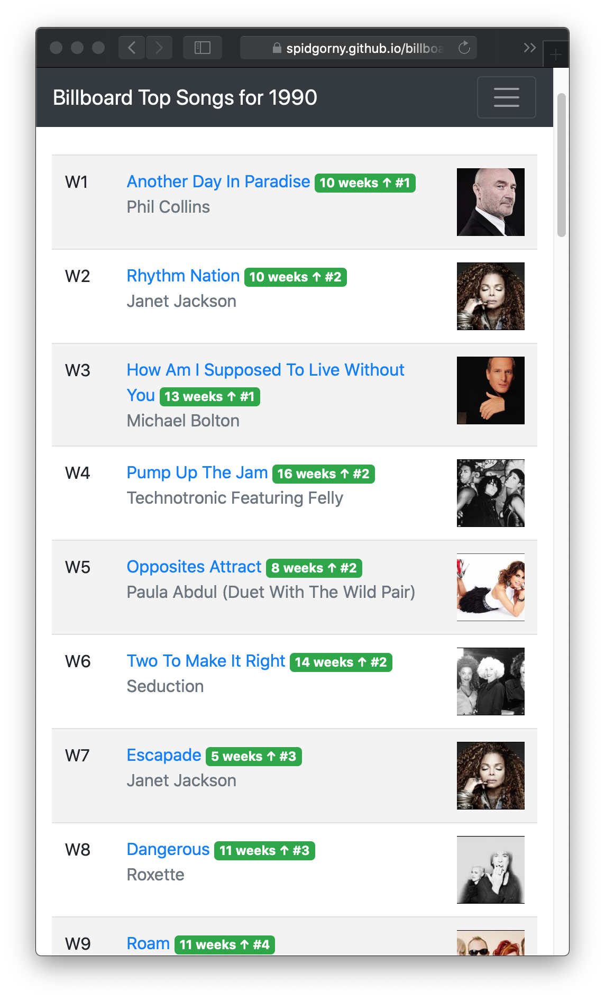

# Idea

Fetch every Billboard Top 100 song and create a playlist that will have all the top songs only once. Will allow to listen to top songs since 1958.

# Results

* [1990](https://spidgorny.github.io/billboard_top_playlist/poster/1990.html) -
[Spotify Playlist](https://open.spotify.com/playlist/1iMLGc8dkoaFs3DvErzrOB?si=O0xyjkcqQpajvT6Kc0Klfg)
* [1991](https://spidgorny.github.io/billboard_top_playlist/poster/1991.html)
* [1992](https://spidgorny.github.io/billboard_top_playlist/poster/1992.html)
* [1993](https://spidgorny.github.io/billboard_top_playlist/poster/1993.html)
* [1994](https://spidgorny.github.io/billboard_top_playlist/poster/1994.html)
* [1995](https://spidgorny.github.io/billboard_top_playlist/poster/1995.html)
* [1996](https://spidgorny.github.io/billboard_top_playlist/poster/1996.html)
